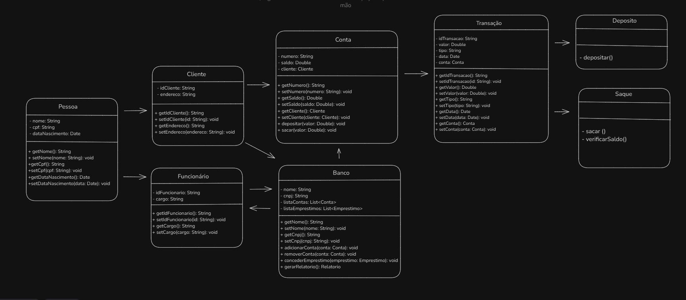

# ON36-IJS-banco-solidario

# **Banco Comunitário Solidário para Comunidades Carentes**

Projeto desenvolvido durante o curso de Imersão Javascript oferecido pela {reprograma}.

---

## **Objetivo**

O objetivo deste projeto é criar um banco comunitário para comunidades carentes, oferecendo serviços financeiros acessíveis e inclusivos, que atendam às necessidades dessas comunidades.

---

## **Diagrama**

